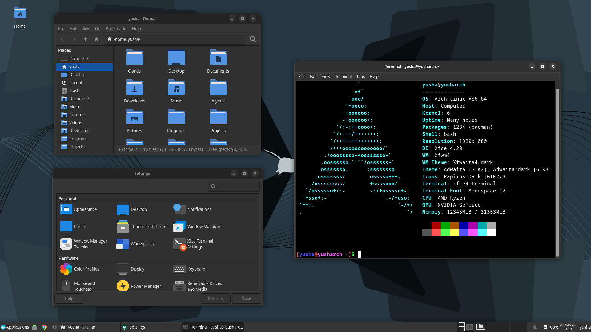
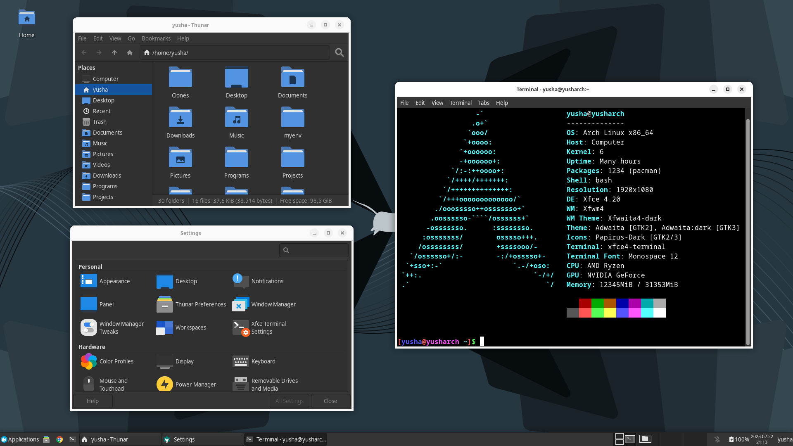

## Adwaita Theme (GNOME 40+) for Xfwm4

This is an Adwaita "port" for Xfwm4 made with screenshots from GNOME applications. [View on xfce-look.org](https://www.xfce-look.org/p/2263355). See GNOME 3 version [here](https://github.com/yusacetin/xfwaita).

### Screenshots

### Build and Installation

The build files are already included so you can directly install them using `install.sh`. You can install only a specific variant using `install.sh [variant name]`. Variant names are "dark" and "light".

Building requires ImageMagick and Python with PIL. Run `build.sh` in the root directory to generate the build files followed by `install.sh` to copy them to your local themes folder, then select one of the variants from Xfce window manager settings under the style tab. You can also do `build.sh [variant name]` to build only a specific variant.

### Uninstallation

Run `uninstall.sh` in the project directory to uninstall all installed variants. Don't forget to select a different theme from settings before you log out.

### Off-center title workaround

Menu, stick, and shade buttons are represented as completely transparent images, so if you place these buttons to one side of the title and the other buttons to the other side, the window title will be centered.

### Remove border padding

To get the borderless version, open generate_borders.py and set DARK_BORDER_WIDTH and LIGHT_BORDER_WIDTH to 1 and then build and install.

### License

Screenshots and source images are the same licenses as GNOME and Xfce. Everything else is GNU General Public License version 3.
